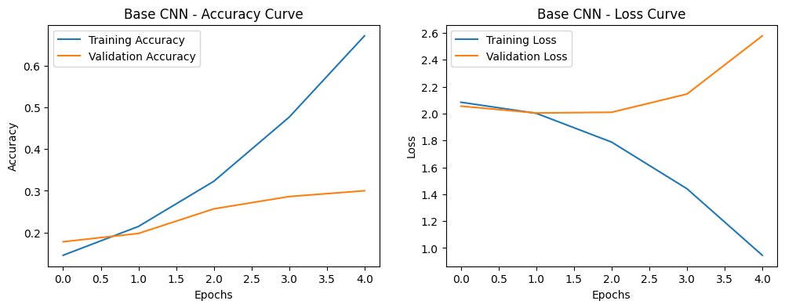
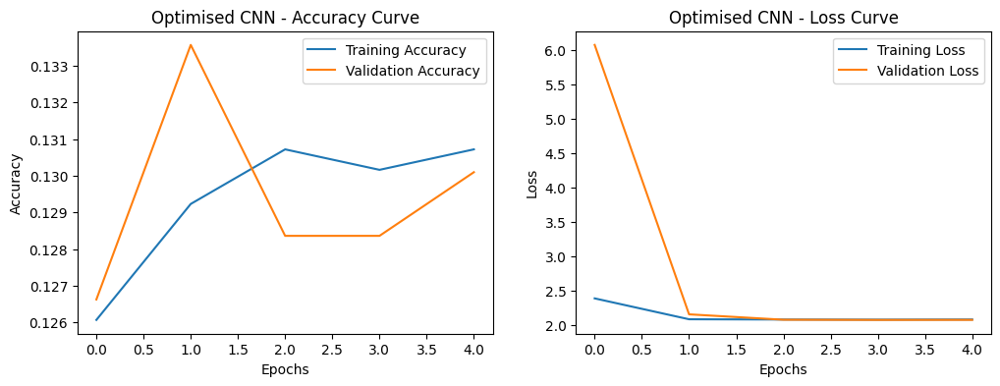

# Handwashing Stage Classification with CNNs

An image classification project that recognises the **8 stages of correct handwashing** from photos, using Convolutional Neural Networks (CNNs) built in TensorFlow/Keras. It follows a **data-centric AI** approach: before training, mislabelled images are detected and removed with **Confident Learning (Cleanlab)**.

> University coursework: CHS2406, University of Huddersfield

---

## Project Overview

The project runs in two stages, one notebook each:

| Notebook | Purpose |
|---|---|
| [`label_error_detection.ipynb`](label_error_detection.ipynb) | Loads the raw images, finds likely label errors with Cleanlab, and saves a cleaned dataset |
| [`handwashing_cnn_classifier.ipynb`](handwashing_cnn_classifier.ipynb) | Preprocesses the cleaned data, trains a baseline CNN and an optimised CNN, then evaluates and compares them |

---

## Dataset

- **8,538 images** across 8 classes (Stage 1 to Stage 8), one folder per handwashing stage
- Collected by multiple contributors, so the data had real-world quality problems: unsupported HEIC files, inconsistent file names, and images placed in the wrong stage folder
- All images resized to **150 × 150 × 3**

*The dataset is not included in this repository because it was provided privately for university coursework.*

---

## 1. Label Error Detection (Data-Centric AI)

Consecutive handwashing stages look very similar, so some images were stored in the wrong folder. Checking thousands of images by hand was impractical, so I used **Confident Learning**:

1. Trained a lightweight CNN using **5-fold Stratified Cross-Validation** to get *out-of-sample* predicted probabilities. Each image is scored by a model that never saw it during training.
2. Passed these probabilities to `cleanlab.filter.find_label_issues()`, ranked by self-confidence.
3. Removed the **top 20% most confident label errors**. This keeps the data clean without throwing away too many images.

**Detected label errors removed per stage:**

| Stage | 1 | 2 | 3 | 4 | 5 | 6 | 7 | 8 |
|---|---|---|---|---|---|---|---|---|
| Removed | 121 | 104 | 94 | 98 | 89 | 124 | 146 | 78 |

**Result:** 8,538 → **7,684 images** after cleaning

---

## 2. Preprocessing

- **Normalisation:** pixel values scaled from 0–255 to 0–1
- **One-hot encoding:** labels converted to 8-dimensional vectors
- **Stratified split:** 70% train (5,378), 15% validation (1,153), 15% test (1,153), with balanced classes in every split

---

## 3. Models

### Baseline CNN
3 convolutional blocks (32 → 64 → 128 filters) with max-pooling, followed by a Dense(128) layer and a Softmax output. Trained with Adam (lr = 0.001) and categorical cross-entropy.

### Optimised CNN
Same backbone, plus:
- **Data augmentation:** rotation, shifts, zoom, horizontal flip
- **Batch Normalisation** after each convolutional layer
- **Dropout (0.5)**
- **Early Stopping** on validation loss
- Lower learning rate (0.0005)

---

## 4. Results

| Model | Test Accuracy |
|---|---|
| Baseline CNN | **30.96%** |
| Optimised CNN | 12.92% |

*(Random guessing across 8 classes would give 12.5%.)*

**Baseline CNN:** training accuracy climbed to 67% in 5 epochs while validation accuracy stayed near 30%, a clear sign of **overfitting**.

**Optimised CNN:** with heavy regularisation and only 5 epochs (limited by compute time on Colab), the model **underfit**. It did not learn useful features and predicted Stage 8 for almost every image.

---

## Key Learnings

- **Data quality comes first.** Confident Learning offered a scalable way to find mislabelled images without manual review.
- **Overfitting vs underfitting.** The two models show both failure modes: the baseline memorised the training data, while the regularised model could not fit in the limited training time.
- **Fine-grained classification is hard.** Adjacent handwashing stages differ by small hand movements, which makes them hard to separate with a small CNN trained from scratch.

## Future Improvements

- **Transfer learning** with a pretrained model (e.g. MobileNetV2, EfficientNet), which usually performs far better on small image datasets
- Train for more epochs on a GPU runtime
- Tune the regularisation strength instead of applying every technique at once
- Add a confusion matrix to see which stages are most often confused

---

## Tech Stack

`Python` · `TensorFlow / Keras` · `Cleanlab` · `scikit-learn` · `OpenCV` · `NumPy` · `Matplotlib` · `Google Colab`

## How to Run

1. Click the **Open in Colab** badge at the top of either notebook.
2. Upload a dataset with one folder per stage (`Stage1` to `Stage8`) to Google Drive, and update `dataset_path` in the notebook.
3. Run `label_error_detection.ipynb` first to create the cleaned dataset, then run `handwashing_cnn_classifier.ipynb`.

---

**Author:** Ayesha Sohail · [GitHub](https://github.com/ayesha112244)
